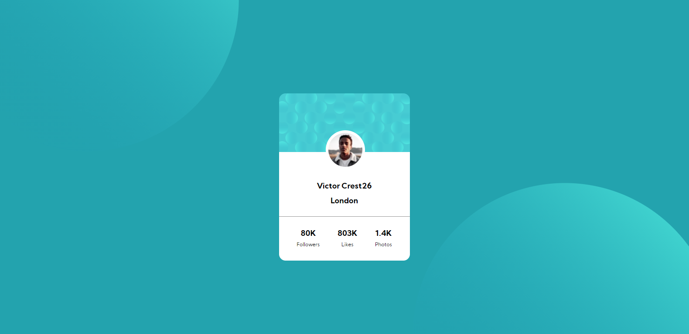
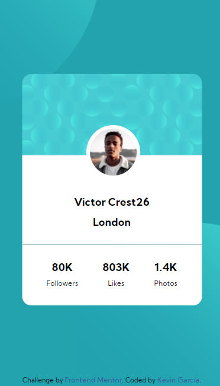

# Frontend Mentor - Profile card component

## Welcome! 👋

This is a solution to the [Profile card component challenge on Frontend Mentor](https://www.frontendmentor.io/challenges/profile-card-component-cfArpWshJ). Frontend Mentor challenges help you improve your coding skills by building realistic projects. 

### The challenge

- Build out the project to the designs provided

### Screenshot

#### Desktop View

#### Desktop View

### What I learned
I learn about z-index property, something that I didn't knew.