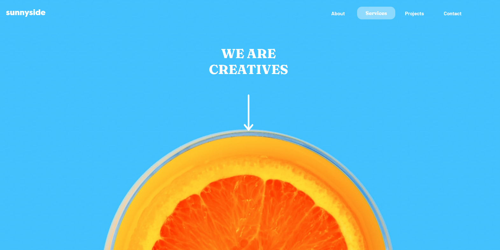
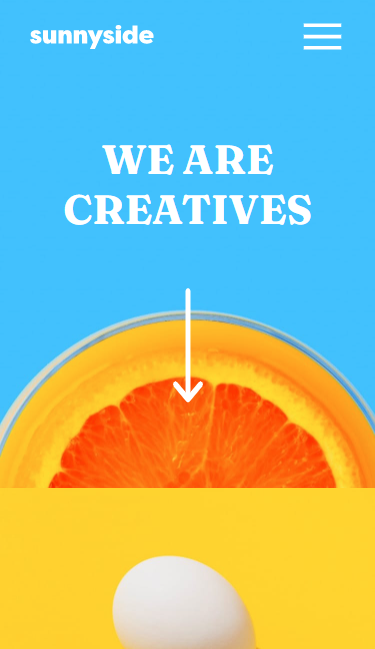
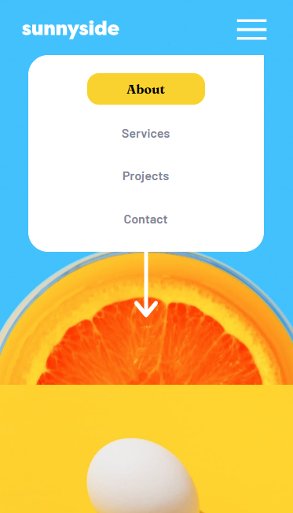

# Frontend Mentor - Sunnyside agency landing page

## Welcome! 👋

Thanks for checking out this front-end coding challenge.

## The challenge

The challenge was  build out this tip calculator app and get it looking as close to the design as possible.

Users should be able to:

- View the optimal layout for the app depending on their device's screen size
- See hover states for all interactive elements on the page

## Building the project

Process:

1. I started defining the HTML structure and making it look good with CSS, starting with mobile view first.
2. I used JavaScript to change between different styles to display the mobile menu.

### Built with
- Semantic HTML5 markup
- CSS custom properties
- Flexbox
- Mobile-first workflow

### What I learned
🚀 .classList.toggle
🚀 .addEventListener

### Continued development
I want to improve my DOM manipulation habilities and how to change styles with JavaScript.

## Author

- Website - [Kevin Garcia](https://k3gar.github.io/)
- Frontend Mentor - [@k3gar](https://www.frontendmentor.io/profile/k3gar)
- Twitter - [@k3gar_](https://twitter.com/k3gar_)

## Screenshots
#### Desktop View

#### Mobile View

